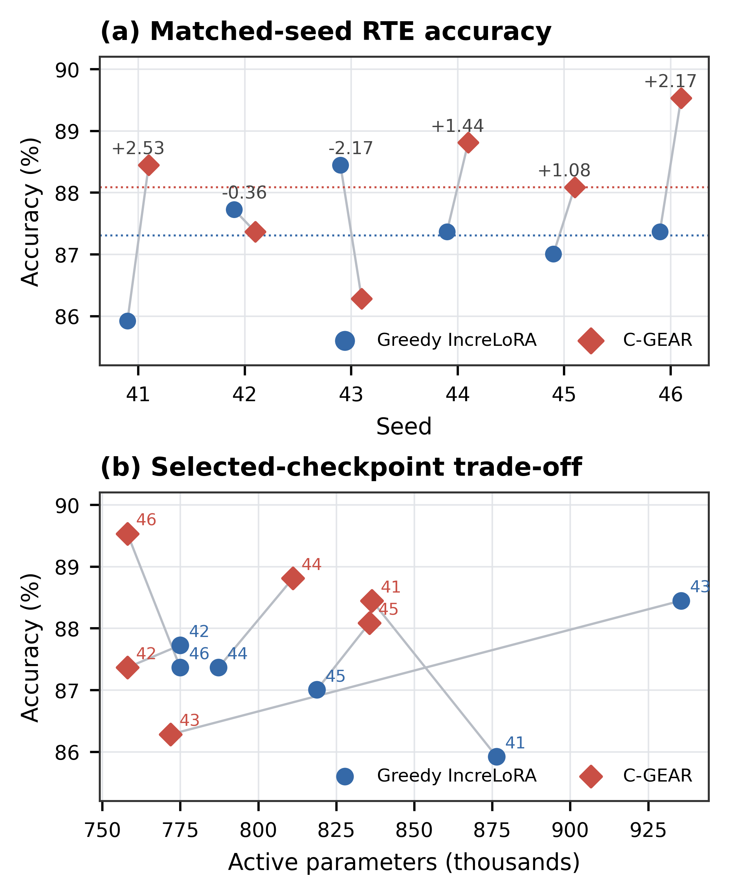

<div align="center">

# C-GEAR

### Calibrated Genetic Efficiency-Aware Rank Allocation for Incremental LoRA Fine-Tuning

[Final report](final_report/paper/cgear_final_report.pdf) · [Six-seed results](final_report/data/canonical_results.md) · [Method workflow](final_report/figures/cgear_allocation_event.pdf) · [Genetic search](final_report/figures/cgear_genetic_search.pdf)

</div>

C-GEAR extends [IncreLoRA](https://github.com/FeiyuZhang98/IncreLoRA) with a calibrated, budget-aware evolutionary allocator for incremental LoRA rank growth. The final study compares C-GEAR with the original Greedy IncreLoRA allocator on GLUE RTE using DeBERTa-v3-base and six matched seeds. C-GEAR searches non-uniform module combinations, calibrates a shortlist on training data only, and can allocate a variable event size—including no rank at all—before stopping growth when further allocation is repeatedly unreliable.

## Overview

IncreLoRA begins each target module at a small rank and adds rank-one components during training. Its Greedy rule selects modules from individual importance scores and continues toward a preset total rank. C-GEAR keeps the same incremental training framework but changes the allocation decision:

1. **Genetic search** generates budget-feasible module sets around the Greedy anchor and through global evolutionary exploration.
2. **Training-only calibration** virtually applies shortlisted allocations on three training folds, then restores model, optimizer, rank, and random-number state.
3. **Conservative gating** accepts growth only when calibrated quality and budget checks pass; otherwise it selects `k = 0`. Two consecutive no-growth decisions stop allocation while ordinary optimization continues on the fixed architecture.

The public implementation name is `rank_allocator=genetic_budgeted_calibrated`. The original Greedy path and the broader upstream GLUE, summarization, and question-answering support remain available.

## Method

For fold-wise training-loss decreases \(g_j\), the implemented calibration score is:

```text
S_cal = mean(g) - 0.5 × std(g)
```

The coefficient `0.5` is a conservative implementation setting, not a formal 95% confidence-bound constant. Calibration never uses RTE validation labels. Candidate growth is constrained by active model parameters—the fixed task head plus active LoRA components represented by the rank pattern—not by all tensors whose `requires_grad` flag is set.

The two diagrams used in the paper provide the compact method description:

- [C-GEAR allocation-event workflow](final_report/figures/cgear_allocation_event.pdf)
- [Genetic-search candidate generation](final_report/figures/cgear_genetic_search.pdf)

The main implementation is split across:

- [`loralib/loralib/increlora.py`](loralib/loralib/increlora.py): dynamic rank state, allocator dispatch, commit, stopping, and consolidation;
- [`NLU/src/transformers/calibrated_budgeted_evo_allocator.py`](NLU/src/transformers/calibrated_budgeted_evo_allocator.py): Greedy-anchored evolutionary candidate generation and budget repair;
- [`NLU/src/transformers/calibrated_rank_calibration.py`](NLU/src/transformers/calibrated_rank_calibration.py): virtual training-only candidate calibration and exact restoration;
- [`NLU/src/transformers/rank_telemetry.py`](NLU/src/transformers/rank_telemetry.py): append-only observational telemetry;
- [`NLU/scripts/rank=2/run_rte_allocator.sh`](NLU/scripts/rank=2/run_rte_allocator.sh): the final matched RTE runner.

## Main results

All values below are regenerated from the completed matched runs for seeds **41, 42, 43, 44, 45, and 46**. Values after `±` are sample standard deviations.

| Method | RTE accuracy ↑ | Selected active parameters ↓ | Selected rank ↓ | Final active parameters ↓ | Final rank ↓ |
|---|---:|---:|---:|---:|---:|
| Greedy IncreLoRA | 87.30 ± 0.84% | 828,005 ± 65,234 | 99.0 ± 27.8 | 933,650 ± 5,337 | 144.0 ± 0.0 |
| C-GEAR | **88.09 ± 1.14%** | **795,225 ± 37,123** | **86.7 ± 14.5** | **804,060 ± 39,336** | **89.7 ± 15.0** |

C-GEAR improves mean accuracy by **0.78 percentage points** and wins/ties/loses **4/0/2** matched seeds. The mean seed-wise paired reduction is **3.55%** for selected-checkpoint active parameters and **13.86%** for final-architecture active parameters.

Accuracy is paired only with the active parameters of the same selected checkpoint. Final counts describe the architecture at the end of the allocation trajectory, before the selected checkpoint is reloaded; they do not inherit selected-checkpoint accuracy. See the [per-seed table](final_report/data/canonical_results.md) and [machine-readable aggregate summary](final_report/data/aggregate_summary.json).

<p align="center">
  
</p>

## Scope and limitations

This is a matched local study on one GLUE task, one backbone, one laptop GPU, and six seeds. The reported `±` values are sample standard deviations, not confidence intervals, and the study does not establish statistical significance, cross-task generalization, or universal superiority. C-GEAR loses accuracy on seeds 42 and 43; its selected checkpoint has more active parameters on seeds 44 and 45. Rank-map differences are descriptive, not evidence that a particular allocation causes an accuracy change. Search and calibration add 13.4% mean wall-time overhead in this setup.

## Environment and installation

The completed runs used Python 3.9.25, PyTorch 2.3.1 with CUDA 12.1, the repository's Transformers 4.4.2 fork, and an NVIDIA GeForce RTX 4060 Laptop GPU. Reproduction is not restricted to that GPU. Install a PyTorch build appropriate for the local CUDA or CPU environment instead of copying a hardware-specific wheel blindly.

```bash
git clone https://github.com/Aliflori/C-GEAR.git
cd C-GEAR
python3.9 -m venv .venv
source .venv/bin/activate
python -m pip install --upgrade pip

# Install a suitable PyTorch build first: https://pytorch.org/get-started/locally/
python -m pip install -r NLU/requirements.txt
python -m pip install -e NLU
python -m pip install -e loralib
python -m pip install -r analysis/requirements.txt
```

`NLU/requirements.txt` is inherited from the original codebase and is not a complete lockfile for the final local machine. The recorded core software and hardware metadata are preserved in [`final_report/data/experiment_configuration.json`](final_report/data/experiment_configuration.json).

## Reproducing the experiments

The commands below reproduce the official `ali_last` directory names in a **fresh output tree**. Each seed is propagated directly to the training script. Run Greedy first because each C-GEAR run uses its matched Greedy final rank pattern to define the active-parameter budget.

> **Existing-output safety:** the Greedy wrapper passes `--overwrite_output_dir`, so the loop below explicitly refuses an existing run directory. The calibrated wrapper independently refuses populated or completed output directories. Do not remove these guards when valuable local runs are present.

### Greedy IncreLoRA, seeds 41–46

From the repository root:

```bash
source .venv/bin/activate
cd NLU
set -euo pipefail

for seed in 41 42 43 44 45 46; do
  output="$PWD/output/glue/rte_allocator/greedy/ali_last_seed${seed}"
  if [ -e "$output" ]; then
    echo "Refusing to overwrite $output" >&2
    exit 1
  fi
  mkdir -p "$output"
  CUDA_VISIBLE_DEVICES=0 bash scripts/rank=2/run_rte_allocator.sh \
    ali_last greedy "$seed" 2>&1 | tee "$output/terminal.log"
done
```

Outputs are written to `NLU/output/glue/rte_allocator/greedy/ali_last_seed{seed}/`, including the externally teed `terminal.log`.

### C-GEAR, seeds 41–46

After all matched Greedy runs finish, remain in `NLU/` and run:

```bash
set -euo pipefail

for seed in 41 42 43 44 45 46; do
  CUDA_VISIBLE_DEVICES=0 bash scripts/rank=2/run_rte_allocator.sh \
    ali_last genetic_budgeted_calibrated "$seed" \
    "$PWD/output/glue/rte_allocator/greedy/ali_last_seed${seed}/rank_pattern.json" \
    0.94
done
```

Outputs are written to `NLU/output/glue/rte_allocator/genetic_budgeted_calibrated/ali_last_seed{seed}_budget0.94/`. The calibrated wrapper tees complete stdout/stderr to `terminal.log` itself.

<details>
<summary><strong>Exact matched training and allocator configuration</strong></summary>

| Group | Setting |
|---|---|
| Data/model | GLUE RTE; `microsoft/deberta-v3-base`; accuracy metric |
| Duration | 25 epochs; 1,950 optimization steps |
| Input/batches | maximum length 192; train batch 32; evaluation batch 8 |
| Optimization | repository AdamW; learning rate `1.2e-3`; linear scheduler; 100 warm-up steps; weight decay `0.01`; maximum gradient norm `1.0`; FP16 |
| Evaluation/checkpoints | evaluate and save every 100 steps; keep one checkpoint; load best at end by accuracy; log every 10 steps |
| LoRA | SVD parameterization; alpha 32; dropout 0; orthogonal coefficient 0.3 |
| Target modules | query, key, value, attention output, FFN intermediate, and FFN output in all 12 layers (72 modules) |
| Rank schedule | initial rank 1 per module; average target rank 2 (total rank 144); allocation warm-up 100; interval 100; `top_h=5`; importance EMA coefficients 0.85/0.85; one component per selected module |
| Genetic search | population 12; 4 generations; mutation 0.10; crossover 0.80; interaction/redundancy/cost/diversity settings 0.20/0.20/0.30/0.10; at most 2 Greedy-anchor replacements; no local search |
| Calibration | 3 training batches of size 8; shortlist top 6; seed offset 1000; `S_cal = mean(g) - 0.5 × std(g)` |
| Growth/stopping | event size `k ∈ {0,…,5}`; no-growth patience 2; minimum consolidation window 300 steps; 25-step new-rank warm-up |
| Budget | hard active-parameter budget at 0.94 of the matched Greedy reference pattern |

The complete telemetry-recovered configuration, including quality gates and tolerances, is in [`experiment_configuration.json`](final_report/data/experiment_configuration.json).

</details>

## Analysis, figures, and report

The raw training outputs are intentionally ignored by Git. With all 12 official local run directories present, regenerate and validate every six-seed statistic and telemetry table:

```bash
source .venv/bin/activate
python analysis/regenerate_six_seed_analysis.py
```

Regenerate all paper and auxiliary figures from the tracked canonical tables without training:

```bash
python analysis/generate_report_figures.py
```

For a machine that also has the 12 raw runs, TeX Live/BibTeX, and MuPDF's `mutool`, the complete validated report pipeline is:

```bash
bash analysis/build_final_report.sh
```

A clean clone already contains the canonical six-seed CSV/JSON tables. It can regenerate figures directly and recompile the paper in `final_report/paper/`, but raw-artifact revalidation requires the ignored local `NLU/output/` runs. Standalone telemetry files can be parsed and plotted with [`parse_rank_telemetry.py`](analysis/parse_rank_telemetry.py) and [`plot_rank_telemetry.py`](analysis/plot_rank_telemetry.py).

The compiled four-page paper is available here: **[C-GEAR final report](final_report/paper/cgear_final_report.pdf)**.

## Repository structure

| Path | Purpose |
|---|---|
| [`NLU/`](NLU/) | DeBERTa/GLUE training stack, allocator implementations, RTE runner, telemetry, and regression tests |
| [`loralib/`](loralib/) | Dynamic SVD-LoRA layers and rank-allocation controller |
| [`analysis/`](analysis/) | Telemetry validation, six-seed statistics, plotting, tests, and report build pipeline |
| [`final_report/`](final_report/) | Canonical lightweight data, figures, LaTeX/BibTeX source, and final PDF |
| [`NLG_QA/`](NLG_QA/) | Original IncreLoRA summarization and question-answering support |

## Lightweight validation

No model training is required for the maintained allocator and offline-analysis suites:

```bash
source .venv/bin/activate
PYTHONDONTWRITEBYTECODE=1 PYTHONPATH=NLU/src:loralib \
  python -m unittest \
    NLU.tests.test_evo_allocator \
    NLU.tests.test_budgeted_evo_allocator \
    NLU.tests.test_calibrated_budgeted_evo_allocator \
    NLU.tests.test_rank_telemetry \
    analysis.tests.test_parse_rank_telemetry \
    analysis.tests.test_plot_rank_telemetry -v
```

## Base work and attribution

This repository is a research fork of **IncreLoRA: Incremental Parameter Allocation Method for Parameter-Efficient Fine-tuning** by Feiyu Zhang, Liangzhi Li, Junhao Chen, Zhouqiang Jiang, Bowen Wang, and Yiming Qian ([paper](https://doi.org/10.48550/arXiv.2308.12043), [official repository](https://github.com/FeiyuZhang98/IncreLoRA)). IncreLoRA supplies the incremental-rank training base; C-GEAR adds calibrated evolutionary allocation, budget and stopping logic, dynamic-checkpoint safeguards, telemetry, validation, and report artifacts. This project is not an official upstream release.

IncreLoRA builds on **LoRA: Low-Rank Adaptation of Large Language Models** by Hu et al. ([paper](https://openreview.net/forum?id=nZeVKeeFYf9), [reference implementation](https://github.com/microsoft/LoRA)). The NLU/NLG stacks also retain their inherited Hugging Face and Microsoft LoRA attribution. Upstream licenses remain in [`NLU/LICENSE`](NLU/LICENSE), [`NLG_QA/LICENSE`](NLG_QA/LICENSE), and [`loralib/LICENSE.md`](loralib/LICENSE.md); no single blanket license is asserted here for the combined research fork.

## Authors

- Ali Naghiloo
- Mohammad Farid Barenji

Sharif University of Technology, Department of Electrical Engineering<br>
Deep Learning course · Instructor: Dr. Bejani · Mentor: Eng. Mehran Advand
